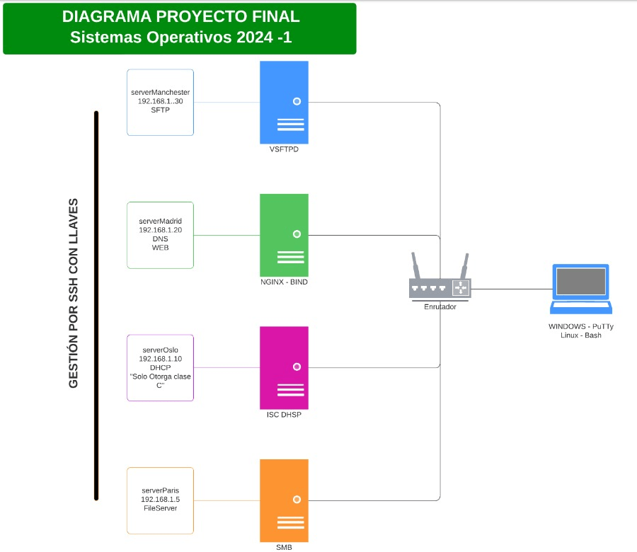

#  Proyecto Final - Sistemas Operativos 2024-1

Este repositorio contiene el taller final del curso de Sistemas Operativos. A continuación, se detallan las configuraciones y servicios implementados en cada servidor.

## Tabla de Contenidos
- [Descripción del Taller](#descripción-del-taller)
- [Configuración de Servidores](#configuración-de-servidores)
  - [Server Manchester](serverManchester/README.md)
  - [Server Madrid](serverMadrid/README.md)
  - [Server Oslo](serverOslo/README.md)
  - [Server Paris](serverParis/README.md)
- [Informe Detallado](informe/README.md)

## Descripción del Taller

En este taller, se configurarán varios servidores utilizando Debian y Ubuntu Server para proporcionar servicios de SFTP, DNS, Web, DHCP y compartición de archivos. 

Esta actividad representa la actividad final del curso de Sistemas Operativos, para cumplir con la competencias establecidas deberán desarrollar la siguientes actividad:

Utilizando herramientas de virtualización, diseñe la estructura necesaria para cumplir con la topología propuesta en la imagen.
Los servidores serverManchester, serverMadrid y serverOslo serán lanzados bajo debian y el serverParis bajo ubuntuServer. (Ultima versión o la anterior estable).
Cada servidor mencionado es una máquina o instancia independiente.
Por practicidad al momento de verificar las configuraciones, se revisará en un primer momento el servicio DHCP, posteriormente se validarán los demás servicios.
Cada equipo de trabajo deberá realizar un informe que detalle todo el proceso de desarrollo y configuración del laboratorio.
Cada equipo deberá realizar una presentación para el día de la sustención.

## Configuración de Servidores

Cada servidor tiene su propia sección donde se detallan los pasos para su configuración:
- [Server Manchester](serverManchester/README.md)
- [Server Madrid](serverMadrid/README.md)
- [Server Oslo](serverOslo/README.md)
- [Server Paris](serverParis/README.md)

## Informe Detallado

Un informe detallado que documenta todo el proceso de configuración se puede encontrar en la sección [Informe Detallado](informe/README.md).
